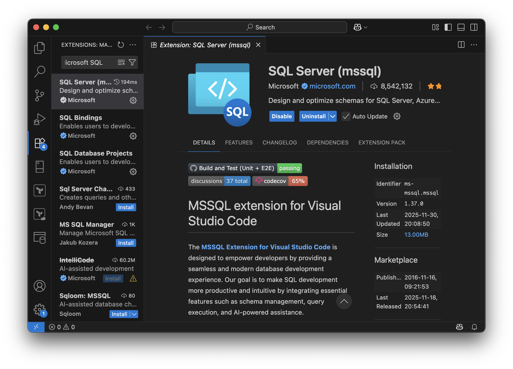
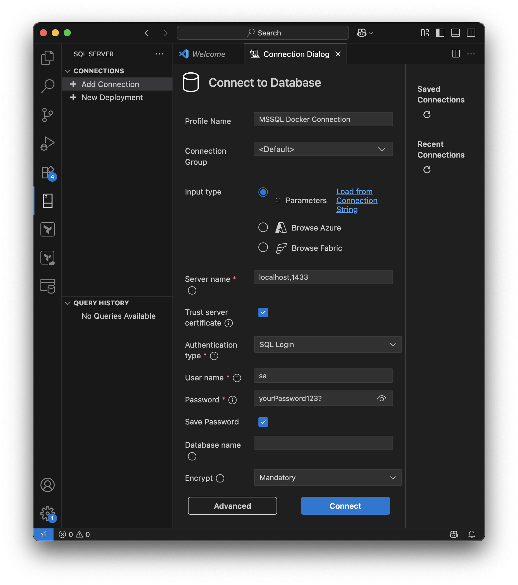
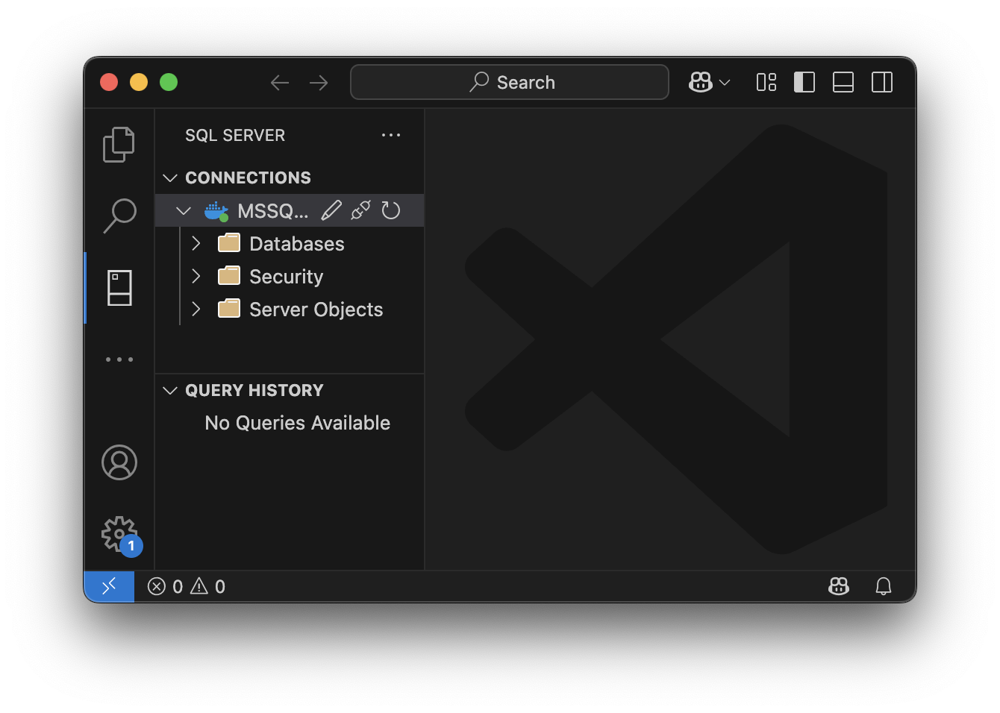

# Linux Installation Guide: Microsoft SQL Server 2022 Express

This guide shows you how to set up Microsoft SQL Server 2022 on your local Linux machine for use with Visual Studio Code. It works on common distributions such as Ubuntu, Debian, Fedora, and Arch Linux. Since there is no native package for every distribution, we will run SQL Server in a Docker container.


### Why use 2022 instead of 2025?

I chose the 2022 version of Microsoft SQL Server because it is more stable, and the university lecture does not require the features of the 2025 version. The 2025 version (as of 11/2025) tends to crash randomly.


## Prerequisites

1. Install [Docker Engine](https://docs.docker.com/engine/install/). Follow the guide for your distribution. Docker Desktop is optional on Linux; the Docker Engine (CLI) is sufficient.

2. (Recommended) Add your user to the `docker` group so you can run Docker without `sudo`:
    ```bash
    sudo usermod -aG docker $USER
    ```
    Log out and back in (or run `newgrp docker`) for the change to take effect. If you skip this step, prefix the Docker commands below with `sudo`.

3. Install [Visual Studio Code](https://code.visualstudio.com/). Most distributions also offer it via their package manager (e.g. the `code` package or a Flatpak/Snap).


## Instructions

1. Make sure the Docker service is running:
    ```bash
    sudo systemctl start docker
    ```
    You can enable it to start on boot with `sudo systemctl enable docker`.

2. Open a terminal.

3. Run the following command in the terminal to pull the Docker image for Microsoft SQL Server 2022:
    ```bash
    docker pull mcr.microsoft.com/mssql/server:2022-latest
    ```

4. Start the Docker container with the following command. Please use the password as shown (it must meet SQL Server's complexity requirements):
    ```bash
    docker run -e "ACCEPT_EULA=Y" -e "MSSQL_SA_PASSWORD=yourPassword123?" -p 1433:1433 --name sql2022express --hostname sql2022express -v ~/docker-data/sqlserver:/var/opt/mssql -d mcr.microsoft.com/mssql/server:2022-latest
    ```
    This command creates a directory called "docker-data" in your home folder to store SQL Server data, ensuring no data loss if the container is deleted.

5. The container should now be running. On some systems a warning may appear indicating that the requested image's platform does not match the detected host platform. This warning can be ignored. I decided not to fix this warning via an additional argument to keep the commands similar across machines.

6. Check that the container is running with the following command:
    ```bash
    docker ps
    ```
    You should see a container named `sql2022express` with a status of "Up".

7. Start Visual Studio Code and go to the Extensions menu to install the "SQL Server (mssql)" extension by Microsoft.

    

8. In the new "SQL Server" menu on the left in Visual Studio Code, click "Add Connection" and enter the following values:

    

    - **Server name**: This can be seen as the server URL. If you have followed the docker run command, it will be **localhost,1433**.
    - **User name**: Use "sa" here. This stands for system administrator.
    - **Password**: This is the password you set when running the Docker container.

9. Click "Connect." The connection should be established and look like this:

    

10. When finished, you can stop the Docker container with `docker stop sql2022express`. You can restart it later with `docker start sql2022express`. If you encounter issues with the container, you may delete it (`docker rm sql2022express`) and recreate it by repeating steps 3 and 4. Your changes to SQL Server will be saved because of the volume.


## Troubleshooting

- **Permission denied while talking to the Docker daemon**: Your user is not in the `docker` group yet. Either complete the group setup in the prerequisites (and re-login) or prefix the Docker commands with `sudo`.

- **Port 1433 already in use**: Another service (or an old container) is using the port. Stop the conflicting service, or remove the old container with `docker rm -f sql2022express` before starting a new one.

- **Command not working**: When copying commands from formatted markdown (e.g., PDF or GitHub), the syntax may become corrupted. If this happens, type the command manually or copy it from the raw file.

- **Volume becomes corrupted**: If you set up the container incorrectly (e.g., using a password that does not meet requirements), you may encounter unpredictable behavior. To fix this, delete the Docker container (`docker rm -f sql2022express`) and remove the folder where the volume is stored (usually `~/docker-data`).

If you encounter any other issues, feel free to reach out to me at my university email address: lars_rolf.kuehn@edu.fhdw.de or arbnor.memedi@edu.fhdw.de
