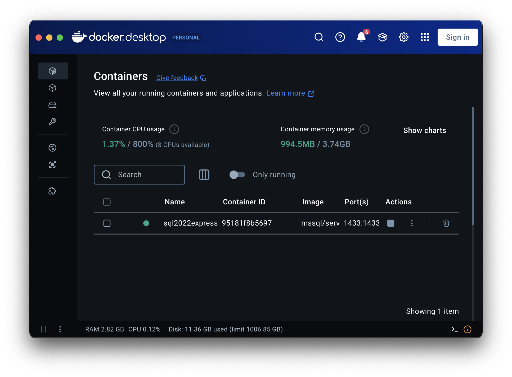
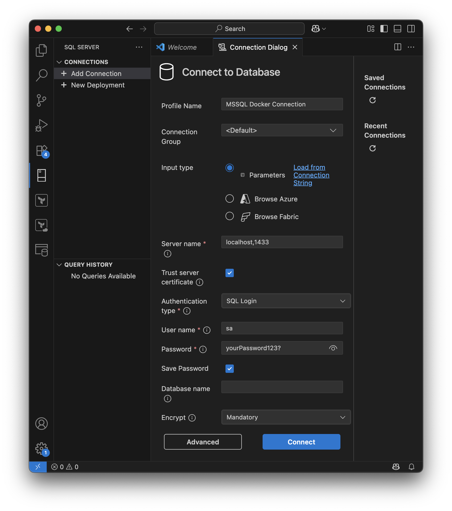

# macOS Installation Guide: Microsoft SQL Server 2022 Express

This guide shows you how to set up Microsoft SQL Server 2022 on your local macOS machine. It works for Apple Silicon (M1, M2, etc.) as well as older Macs with Intel processors. Since there is no native way to install SQL Server on macOS, we will orchestrate it as a Docker container.


### Why use 2022 instead of 2025?

I chose the 2022 version of Microsoft SQL Server because its Docker container is more stable. The 2025 version (as of 11/2025) tends to crash randomly.


## Prerequisites

1. Install [Docker Desktop](https://www.docker.com/products/docker-desktop/)

2. Install [Visual Studio Code](https://code.visualstudio.com/)


## Instructions

1. Start Docker Desktop and initialize the application.
2. Open Terminal.
3. Run the following command in the terminal to pull the latest Docker image for Microsoft SQL Server:
    ```bash
    docker pull mcr.microsoft.com/mssql/server:2025-latest
    ```
4. Start the Docker container with the following command. Please use the password as shown:
    ```bash
    docker run -e "ACCEPT_EULA=Y" -e "MSSQL_SA_PASSWORD=yourPassword123?" -p 1433:1433 --name sql2022express --hostname sql2022express -v ~/docker-data/sqlserver:/var/opt/mssql -d mcr.microsoft.com/mssql/server:2022-latest
    ```
    This command creates a directory called "docker-data" to store SQL Server data, ensuring no data loss if the container is deleted.

5. The container should be running. Note that a warning may pop up in the terminal indicating that the requested image's platform does not match the detected host platform. This warning can be ignored. I decided not to fix this warning via an additional argument to keep the commands similiar for Apple Silicon and Intel machines.

6. Check the container in Docker Desktop to ensure it is running.
    

7. Start Visual Studio Code and go to the Extensions menu to install the "SQL Server (mssql)" extension by Microsoft.
    

8. In the new "SQL Server" menu on the left in Visual Studio Code, click "Add Connection" and enter the following values:
    

    - **Server name**: This is can be seen as the server url. Therefore it is "localhost" + "," + "_PORT_". If you have followed the docker run command it will be **localhost,1433**.
    - **User name**: We use "sa" here. This stands for system administrator.
    - **Password**: This is the password you've set when running the docker container.

9. Click "Connect." The connection should be established and look like this:
    

10. When finished, you can stop the Docker container via Docker Desktop. You do not need to use the terminal again. You can restart the container from Docker Desktop. If the container causes issues, you can delete it entirely. Your changes to SQL Server will be saved because of the volume.


## Troubleshooting

- **Command not working**: When copying commands from formatted markdown (e.g., PDF or GitHub), the syntax may become corrupted. If this happens, type the command manually or copy it from the raw file.

- **Volume becomes corrupted**: If you set up the container incorrectly (e.g., using a password that does not meet requirements), you may encounter unpredictable behavior. To fix this, delete the Docker container via Docker Desktop and remove the folder where the volume is stored (usually `_youruser/docker-data`). Also, delete the folder from the trash.

If you encounter any other issues, feel free to reach out to me at my university email address: lars_rolf.kuehn@edu.fhdw.de