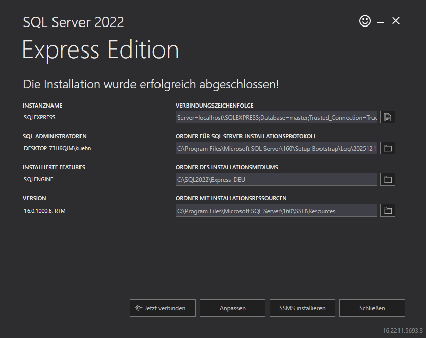
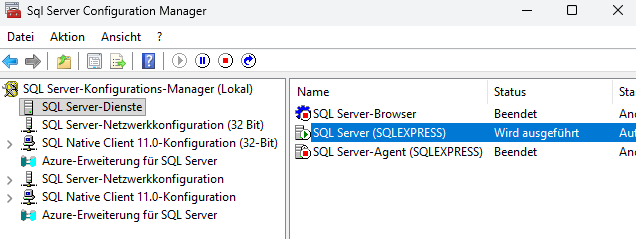
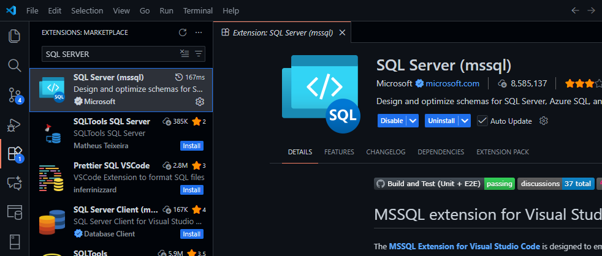
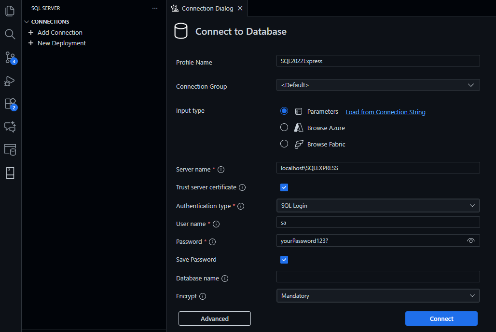
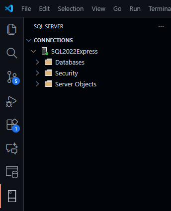

# Windows Installation Guide: Microsoft SQL Server 2022 Express

This guide shows you how to set up Microsoft SQL Server 2022 on your local Windows machine for use with Visual Studio Code.


### Why use 2022 instead of 2025?

I chose the 2022 version of Microsoft SQL Server because it is more stable, and the university lecture does not require the features of the 2025 version.

## Prerequisites

1. Install [Visual Studio Code](https://code.visualstudio.com/)

## Instructions

1. Download [Microsoft SQL Server 2022 Express](https://www.microsoft.com/en-us/download/details.aspx?id=104781)

2. Open the installer, choose "Standard" and proceed with the installation.


3. After the installation is complete, a window will pop up, giving you the option to connect to the server via terminal. Click on "Jetzt verbinden".

    

    If you missed this opportunity, just open a terminal and paste one of the following commands into it:
    ```bash
    sqlcmd -S localhost\SQLEXPRESS -E

    # OR

    sqlcmd -S <name-of-your-device>\SQLEXPRESS -E
    ```


4. After that, you should have a terminal open where you see a new line starting with `1>`, allowing you to configure your SQL Server.

5. Set your system administrator (SA) password with this command in the terminal. Please use the password as shown (it must meet SQL Server's complexity requirements):
    ```bash
    ALTER LOGIN sa WITH PASSWORD = 'yourPassword123?';
    GO
    ALTER LOGIN sa ENABLE;
    GO
    ```

6. Activate mixed mode so SA is properly configured with this command in the terminal:
    ```bash
    EXEC xp_instance_regwrite
      N'HKEY_LOCAL_MACHINE',
      N'Software\Microsoft\MSSQLServer\MSSQLServer',
      N'LoginMode',
      REG_DWORD,
      2;
    GO
    ```

7. You can exit the terminal with `exit()` or simply close it now.

8. Open the SQL Server Configuration Manager on your Windows machine. This application is installed with the installation script.

9. Locate the "SQL Server (SQLEXPRESS)" service. Right-click on the service and then restart it.

    

10. Start Visual Studio Code and go to the Extensions menu. Install the "SQL Server (mssql)" extension by Microsoft.

    

11. In the new "SQL Server" menu on the left in Visual Studio Code, click "Add Connection" and enter the following values:

    

    - **Server name**: This can be seen as the server URL. In this case, it is `localhost\SQLEXPRESS`.
    - **User name**: Use "sa" here. This stands for system administrator.
    - **Password**: This is the password you set when configuring the password in the terminal.

12. Click "Connect." The connection should be established and look like this:

    

## Troubleshooting

- **Command not working**: When copying commands from formatted markdown (e.g., PDF or GitHub), the syntax may become corrupted. If this happens, type the command manually or copy it from the raw file.

- **Forgot password?**: Repeat steps 5-9.

If you encounter any other issues, feel free to reach out to me at my university email address: lars_rolf.kuehn@edu.fhdw.de
